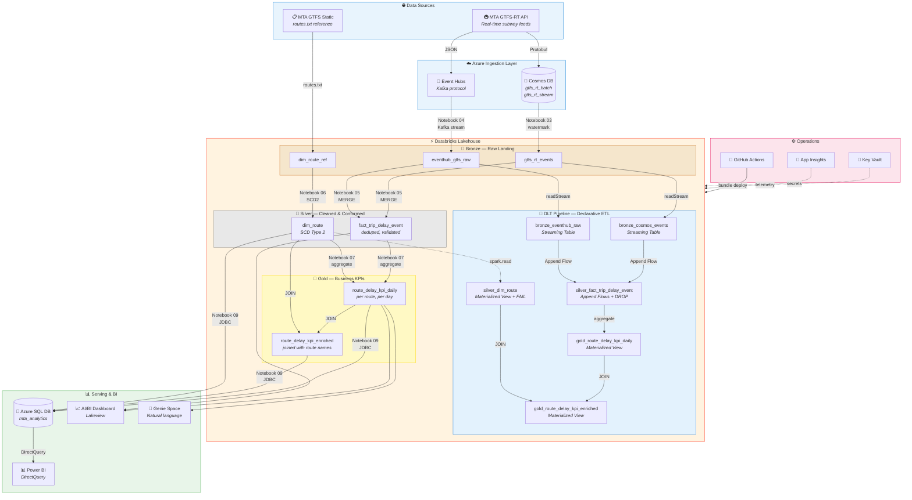
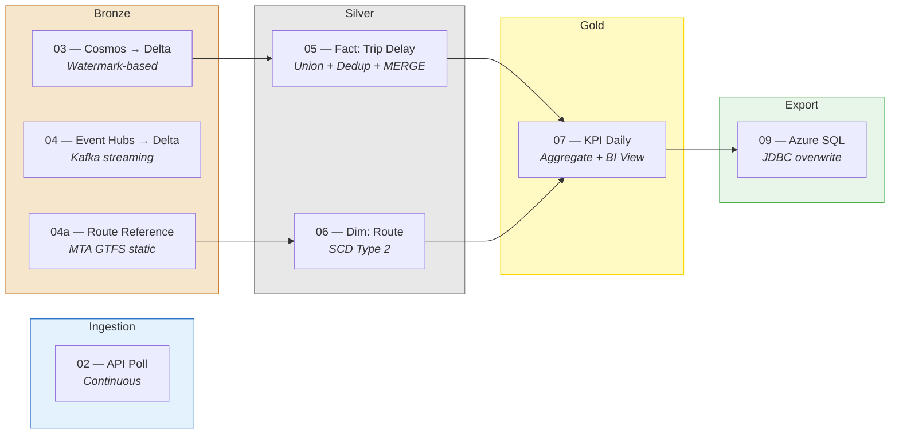
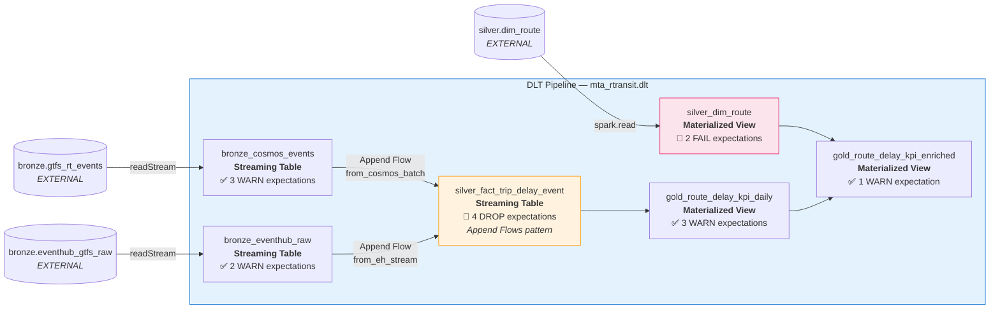
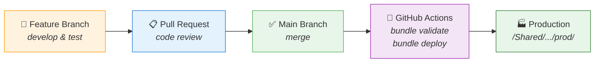

# 🚇 MTA Real-Time Transit Pipeline

[](https://azure.microsoft.com)
[](https://databricks.com)
[](https://delta.io)
[](https://github.com/features/actions)
[](https://powerbi.microsoft.com)

End-to-end **Azure Data Engineering** platform ingesting NYC MTA real-time subway feeds through a **medallion architecture** on Databricks — with CI/CD, declarative ETL (DLT), monitoring, and BI serving.

> Built to demonstrate production-grade integration across **9 Azure services**, **declarative + imperative pipelines**, and a complete **DevOps workflow** from code to dashboard.

---

## 🏗️ Architecture Overview



---

## 🔄 Data Flow — Regular Pipeline

The notebook pipeline runs daily at **6 AM ET** through a multi-task DAG job.



---

## 🔷 Data Flow — DLT Pipeline (Lakeflow Spark Declarative Pipelines)

Runs daily at **7 AM ET** (1 hour after the regular pipeline), on **serverless compute**. Reads from existing bronze Delta tables and applies declarative transformations with **data quality expectations**.



### Expectations Strategy
| Layer | Action | Why |
|-------|--------|-----|
| **Bronze** | `WARN` | Keep all raw data, log quality issues for visibility |
| **Silver Fact** | `DROP` | Remove invalid records — clean data for aggregation |
| **Silver Dimension** | `FAIL` | Halt pipeline if dimension data is broken — downstream depends on it |
| **Gold** | `WARN` | Log anomalies but don't block KPI output |

---

## ⏰ Job Orchestration

```mermaid
gantt
    title Daily Schedule (ET timezone)
    dateFormat HH:mm
    axisFormat %H:%M

    section Continuous
    API Poll (PAUSED)           :crit, 00:00, 24h
    EH Streaming (PAUSED)       :crit, 00:00, 24h

    section Scheduled
    Table Maintenance (Sun)     :active, 02:00, 30min
    Daily Batch Pipeline        :active, 06:00, 45min
    DLT Refresh                 :active, 07:00, 15min
    Health Monitor              :done, 00:00, 10min
    Health Monitor              :done, 06:00, 10min
    Health Monitor              :done, 12:00, 10min
    Health Monitor              :done, 18:00, 10min
```



| Job | Schedule | What it does |
|-----|----------|-------------|
| **Daily Batch Pipeline** | 6:00 AM ET | `03 → 04a → 05 → 06 → 07 → 09` (full medallion refresh) |
| **DLT Refresh** | 7:00 AM ET | Incremental refresh of all DLT tables (serverless) |
| **Health Monitor** | Every 6 hours | Checks freshness, job health, data quality |
| **Table Maintenance** | Sunday 2 AM | OPTIMIZE, VACUUM, liquid clustering, ANALYZE |
| **API Poll** | PAUSED | Continuous MTA feed ingestion to Cosmos + Event Hubs |
| **EH Streaming** | PAUSED | Continuous Event Hubs to Bronze streaming |

---

## 🔧 Technology Stack

| Category | Technologies |
|----------|-------------|
| **Compute** | Databricks (Unity Catalog, Delta Lake, Structured Streaming, DLT, Photon) |
| **Storage** | ADLS Gen2 (external Delta tables), Cosmos DB (document store) |
| **Streaming** | Event Hubs (Kafka protocol), Structured Streaming (foreachBatch) |
| **ETL** | Lakeflow Spark Declarative Pipelines (Append Flows, expectations, MVs) |
| **Orchestration** | Databricks Jobs (multi-task DAG), GitHub Actions CI/CD |
| **Governance** | Unity Catalog (lineage, access control), Key Vault (secrets) |
| **Monitoring** | Application Insights (telemetry), Health Monitor notebook |
| **Serving** | Azure SQL Database (JDBC export), Power BI (DirectQuery) |
| **BI** | AI/BI Dashboard (Lakeview), Genie Space (natural language analytics) |
| **DevOps** | Databricks Asset Bundles, GitHub Actions, feature branch workflow |

---

## 📁 Project Structure

```
azure-databricks-transit-platform/
│
├── .github/workflows/
│   └── deploy.yml                          # CI/CD: main → bundle deploy -t prod
│
├── notebooks/
│   ├── 01_setup_and_configs.py             # DDL for all schemas and tables
│   ├── 02_mta_gtfs_rt_to_cosmos.py         # API → Cosmos DB + Event Hubs
│   ├── 03_batch_cosmos_to_delta.py         # Cosmos → Bronze (watermark incremental)
│   ├── 04_streaming_eventhubs_to_bronze.py # Event Hubs → Bronze (Kafka streaming)
│   ├── 04a_ingest_mta_route_ref.py         # MTA GTFS routes.txt → reference table
│   ├── 05_silver_fact_trip_delay_event.py  # Union + dedup + MERGE → Silver fact
│   ├── 06_silver_dim_route.py              # Route dimension with SCD Type 2
│   ├── 07_gold_route_delay_kpi_daily.py    # Daily KPIs per route + BI view
│   ├── 08_pipeline_health_monitor.py       # Freshness, job health, data quality
│   ├── 09_gold_to_azure_sql.py             # Gold → Azure SQL via JDBC
│   └── 10_delta_table_maintenance.py       # OPTIMIZE, VACUUM, liquid clustering
│
├── dlt/transformations/
│   ├── eventhub_raw.py                     # Bronze ST — Event Hubs source
│   ├── cosmos_events.py                    # Bronze ST — Cosmos source
│   ├── fact_trip_delay_event.py            # Silver ST — Append Flows pattern
│   ├── dim_route.py                        # Silver MV — route dimension
│   ├── route_delay_kpi_daily.py            # Gold MV — KPI aggregation
│   └── route_delay_kpi_enriched.py         # Gold MV — enriched join
│
├── dashboards/
│   └── mta_transit_pipeline_operations.lvdash.json
│
├── databricks.yml                          # DABs config (jobs, pipeline, dashboard)
├── PROJECT_CONTEXT.md                      # Detailed project documentation
└── README.md
```

---

## 🗄️ Unity Catalog

```
mta_rtransit (prod)
├── bronze
│   ├── gtfs_rt_events           ← Cosmos batch events
│   ├── eventhub_gtfs_raw        ← Event Hubs stream
│   ├── dim_route_ref            ← GTFS static reference
│   └── _cosmos_watermarks       ← Incremental load state
├── silver
│   ├── fact_trip_delay_event    ← Deduped delay facts
│   └── dim_route                ← Route dimension (SCD2)
├── gold
│   ├── route_delay_kpi_daily    ← Daily KPIs per route
│   └── route_delay_kpi_enriched ← KPIs + route names (VIEW)
└── dlt                          ← DLT managed tables
    ├── bronze_eventhub_raw
    ├── bronze_cosmos_events
    ├── silver_fact_trip_delay_event
    ├── silver_dim_route
    ├── gold_route_delay_kpi_daily
    └── gold_route_delay_kpi_enriched
```

---

## 🚀 Deployment

Uses **Databricks Asset Bundles** with **GitHub Actions** CI/CD.



```bash
# Manual deployment
databricks bundle deploy -t dev    # Development (personal workspace)
databricks bundle deploy -t prod   # Production (/Shared/)
```

---

## 🎯 Key Design Decisions

| # | Decision | Why |
|---|----------|-----|
| 1 | External tables on ADLS | Full control over storage, survives catalog drops |
| 2 | Watermark incremental load | Avoids re-reading entire Cosmos container each run |
| 3 | Kafka protocol for Event Hubs | Built into Spark — no external Maven JARs |
| 4 | DLT reads from existing Delta | Serverless can't access Key Vault or Cosmos directly |
| 5 | Append Flows over UNION + MERGE | Native multi-source fan-in, DLT-managed dedup |
| 6 | Liquid clustering over ZORDER | Incremental, adaptive, no full-table rewrites |
| 7 | Separate DLT managed schema | `dlt` schema isolates managed tables from external |
| 8 | DLT runs 1 hour after batch | Ensures fresh bronze data before transformation |
| 9 | Azure SQL for Power BI | Faster DirectQuery vs hitting Delta Lake directly |
| 10 | Health monitor every 6 hours | Catch staleness and job failures before users notice |

---

## 📅 Roadmap

- [x] Phase 1 — Security & Observability (Key Vault, App Insights)
- [x] Phase 2 — Analytics & BI (Gold layer, Genie, AI/BI Dashboard, Power BI)
- [x] Phase 3 — CI/CD & DevOps (GitHub, DABs, Actions, dev/prod catalogs)
- [x] Phase 3.5 — Azure SQL export (Gold → Azure SQL via JDBC)
- [x] Phase 3.6 — DLT Pipeline (expectations, Append Flows, serverless)
- [x] Phase 3.7 — Table Optimization (OPTIMIZE, VACUUM, liquid clustering)
- [ ] Phase 4 — ML & Advanced Analytics (delay prediction, MLflow, Model Serving)
- [ ] Phase 5 — Microsoft Fabric integration

---

## 📝 License

This project is for portfolio/educational purposes.
