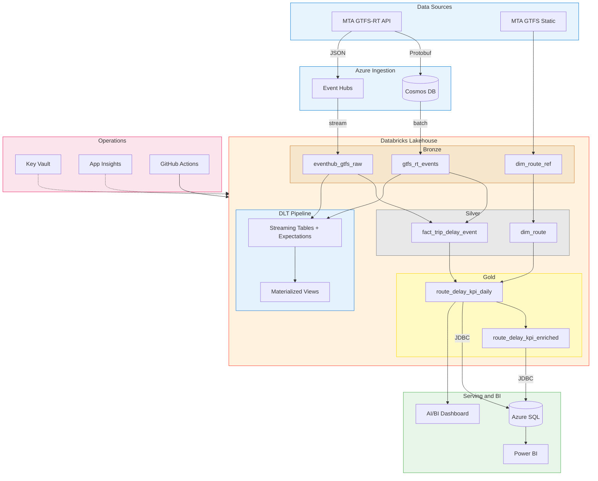
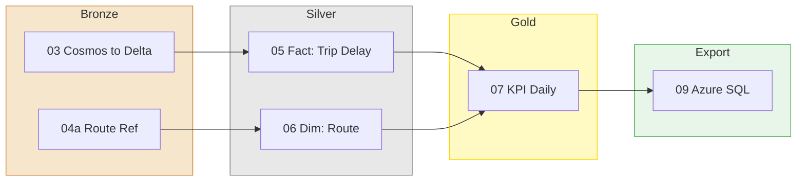
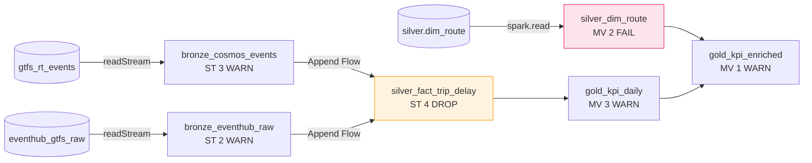
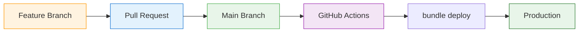

# How I Built a Real-Time Transit Data Pipeline on Azure Databricks — From API to Dashboard

*A deep dive into building a production-grade data engineering platform that ingests NYC subway feeds, processes them through a medallion architecture, and serves KPIs to Power BI — all with CI/CD, declarative ETL, and automated monitoring.*

---

I've been working with Azure and Databricks for a while, and I wanted to build something that goes beyond the typical "read a CSV, do some transformations, write it out" tutorial project. Something that actually reflects what you'd see in a production environment — real-time data, multiple Azure services talking to each other, proper CI/CD, data quality enforcement, and a monitoring layer that catches problems before users notice.

So I built a real-time transit data platform using **NYC MTA subway feeds**. The MTA publishes GTFS-RT (General Transit Feed Specification — Real-Time) data for all subway lines, updated every 30 seconds. That's delay information, trip updates, and vehicle positions for one of the busiest transit systems in the world.

Here's what the project ended up looking like.

---

## The Architecture

The platform integrates **9 Azure services** with Databricks at the center.



The MTA GTFS-RT API emits Protobuf messages. I parse those into JSON and route them two ways:

- **Cosmos DB** — stores the batch-oriented route data (the "slower" feeds)
- **Event Hubs** — handles the real-time stream (letter routes like A/C/E that update frequently)

This dual-path ingestion wasn't just for show. I wanted to demonstrate both batch and streaming patterns side by side, because in real-world pipelines you almost always deal with both.

The interesting part is that I built **two parallel pipeline approaches** on top of the same data:

1. **Imperative pipeline** (11 notebooks, orchestrated via Databricks Jobs)
2. **Declarative pipeline** (Lakeflow Spark Declarative Pipelines / DLT, with expectations and Append Flows)

Both produce equivalent results, but they demonstrate fundamentally different engineering philosophies. More on that below.

---

## The Azure Services — What Talks to What

Before diving into the code, here's how each service fits in:

| Service | Role | Connects To |
|---------|------|-------------|
| **MTA GTFS-RT API** | Source — real-time subway feed (Protobuf) | Cosmos DB, Event Hubs |
| **Cosmos DB** | Document store for batch route data | Databricks Bronze (notebook 03) |
| **Event Hubs** | Message broker for real-time stream | Databricks Bronze (notebook 04) |
| **ADLS Gen2** | Delta Lake storage (external tables) | All Databricks tables |
| **Key Vault** | Secrets management (8 secrets) | All notebooks via `dbutils.secrets` |
| **App Insights** | Telemetry for API calls + micro-batches | Notebooks 02, 03, 04 |
| **Azure SQL** | Gold layer serving for Power BI | Notebook 09 exports via JDBC |
| **GitHub Actions** | CI/CD pipeline | `databricks bundle deploy -t prod` |
| **Power BI** | DirectQuery dashboards | Reads from Azure SQL |

---

## The Notebook Pipeline — Daily Batch DAG



The daily batch job runs at **6 AM ET** and follows a multi-task DAG. Each task passes a `catalog` parameter so the same notebooks work against both `mta_rtransit` (prod) and `mta_rtransit_dev` (dev).

---

## Bronze Layer — Landing Raw Data

### Path 1: Cosmos DB → Bronze (Batch)

Notebook `03` handles the batch path. The tricky part here was avoiding a full re-read of the Cosmos container on every run. On the first version, I was calling `read_all_items()` — which re-ingested everything every time. Not great.

The fix was a **watermark-based incremental load**. I persist the last-processed Cosmos `_ts` timestamp in a small Delta table:

```python
# Query Cosmos for only new/changed documents since last run
query = f"SELECT * FROM c WHERE c._ts > {last_ts}"
docs = list(container.query_items(query=query, enable_cross_partition_query=True))
```

After each successful load, the watermark updates. First run pulls everything (full backfill), subsequent runs pull only changes. If something goes wrong, you can reset the watermark to 0 and replay.

### Path 2: Event Hubs → Bronze (Streaming)

Notebook `04` handles the streaming path using **Event Hubs' Kafka-compatible endpoint**. This was a deliberate choice — Event Hubs exposes a Kafka protocol, and Spark's built-in `kafka` format means zero external Maven JARs:

```python
raw_stream = (
    spark.readStream
    .format("kafka")
    .option("kafka.bootstrap.servers", f"{namespace}:9093")
    .option("subscribe", topic)
    .option("kafka.sasl.mechanism", "PLAIN")
    .option("kafka.security.protocol", "SASL_SSL")
    .option("kafka.sasl.jaas.config", jaas_config)
    .load()
)
```

Each micro-batch gets processed via `foreachBatch`, which lets me add telemetry, route-level breakdowns, and write to Delta with proper schema enforcement.

### Route Reference Data

Notebook `04a` downloads the MTA's static GTFS feed (a ZIP file containing `routes.txt`) and lands route reference data in Bronze. This runs weekly since routes rarely change, but each run creates a new snapshot so we preserve history.

---

## Silver Layer — Cleaning and Conforming

### Fact Table: Trip Delay Events

Notebook `05` is where the two bronze paths converge. The same MTA event can arrive via both Cosmos (batch) and Event Hubs (stream), so deduplication is essential.

The approach: union both sources into a common schema, then deduplicate using `ROW_NUMBER()` over a window partitioned by document ID:

```python
w = Window.partitionBy("id").orderBy(
    F.desc("ingested_at"),
    F.when(F.col("_source") == "batch", 0).otherwise(1),  # batch wins ties
)
deduped = unioned.withColumn("_rn", F.row_number().over(w)).filter("_rn = 1")
```

The result gets `MERGE`d into `silver.fact_trip_delay_event` — an idempotent upsert that's safe to re-run.

### Dimension Table: Routes

Notebook `06` builds the route dimension with a three-tier fallback:

1. **GTFS reference data** from `dim_route_ref` (official MTA source)
2. **Hardcoded MTA mapping** — for routes that appear in the fact data but not in the reference file (express variants like 7X)
3. **Route ID as name** — last resort for completely unknown routes

It maintains `effective_from` / `effective_to` columns for SCD Type 2 tracking.

---

## Gold Layer — Business KPIs

Notebook `07` aggregates the silver fact into daily KPIs per route:

- `trip_update_cnt` — how many trip updates that day
- `avg_delay_sec` — mean first-stop delay
- `p95_delay_sec` — 95th percentile delay (captures worst-case)

An enriched view joins these KPIs with route names for human-readable dashboards:

```sql
CREATE OR REPLACE VIEW gold.route_delay_kpi_enriched AS
SELECT k.*, d.route_short_name, d.route_long_name, d.route_type
FROM   gold.route_delay_kpi_daily k
LEFT JOIN silver.dim_route d ON k.route_id = d.route_id AND d.effective_to IS NULL
```

---

## The DLT Pipeline — Doing It All Declaratively

Here's where it gets interesting. After building the imperative pipeline above, I rebuilt the transformation layer using **Lakeflow Spark Declarative Pipelines** (formerly DLT) to demonstrate the declarative approach.

### DLT Data Flow



### Why Both Approaches?

In a real organization, you'd pick one. But for a portfolio project, showing both approaches — and the trade-offs — is far more valuable than showing either alone.

| Aspect | Imperative (Notebooks) | Declarative (DLT) |
|--------|----------------------|-------------------|
| Dedup approach | Window + ROW_NUMBER + MERGE | Append Flows (multi-source fan-in) |
| Data quality | Manual `is_valid` column | Built-in expectations (WARN/DROP/FAIL) |
| State management | Custom watermark table | DLT-managed checkpoints |
| Orchestration | Job DAG with `depends_on` | DLT auto-resolves |
| Lineage | Implicit | Visual DAG + Unity Catalog |

### Append Flows — The Killer Feature

The DLT pipeline's silver fact table uses the **Append Flows** pattern instead of UNION + MERGE. You define an empty streaming table, then attach multiple flows to it:

```python
from pyspark import pipelines as dp

dp.create_streaming_table(
    name="silver_fact_trip_delay_event",
    expect_all_or_drop=expectations,
)

@dp.append_flow(target="silver_fact_trip_delay_event", name="from_cosmos_batch")
def silver_from_cosmos():
    return spark.readStream.table("bronze_cosmos_events").select(...)

@dp.append_flow(target="silver_fact_trip_delay_event", name="from_eventhub_stream")
def silver_from_eventhub():
    return spark.readStream.table("bronze_eventhub_raw").select(...)
```

Each flow independently streams into the same target. DLT handles the fan-in, deduplication checkpointing, and failure isolation. If one source fails, the other keeps running.

### Expectations Strategy

I designed a tiered expectations strategy — different actions at each layer:

| Layer | Action | Reasoning |
|-------|--------|-----------|
| **Bronze** | WARN | Keep all raw data, just log quality issues for visibility |
| **Silver Fact** | DROP | Remove invalid records — clean data matters for aggregation |
| **Silver Dimension** | FAIL | Halt the pipeline if dimension data is broken — everything downstream depends on it |
| **Gold** | WARN | Log anomalies but don't block KPI output |

### Serverless Gotcha

DLT runs on serverless compute, which is great for cost, but has limitations I didn't expect:

- **Cosmos DB change feed** (`cosmos.oltp.changeFeed`) is not supported on serverless
- **Key Vault-backed secrets** don't resolve via `spark.conf.get()` on serverless

The workaround: the regular pipeline (notebooks 03/04) handles raw ingestion where these are needed, and DLT reads from the already-populated Delta tables. This is actually a clean separation of concerns — ingestion vs. transformation.

---

## Serving — Azure SQL and Power BI

Notebook `09` exports gold-layer data to **Azure SQL Database** via JDBC. Three tables get overwritten daily:

```python
kpi_df.write.format("jdbc") \
    .option("url", JDBC_URL) \
    .option("dbtable", "dbo.route_delay_kpi_daily") \
    .mode("overwrite").save()
```

Why Azure SQL instead of just querying Delta directly? **Power BI DirectQuery performance.** For a dashboard that refreshes every few minutes, hitting a SQL database is significantly faster than hitting an object store through a SQL warehouse. The trade-off is an extra export step, but the daily batch job handles that automatically.

---

## Monitoring — Catching Problems Early

Notebook `08` runs every 6 hours and checks:

1. **Data freshness** — is each table's latest timestamp within its staleness threshold?
2. **Job health** — have any scheduled jobs failed in the last 24 hours?
3. **Data quality** — what percentage of silver events are valid?

It produces a health report:

```
  Tables:        5/5 fresh
  Jobs:          3/3 healthy (24h)
  Data Quality:  97.3% valid
  Silver Events: 57,996
  Routes:        29

  OVERALL STATUS: HEALTHY
```

All backed by **Application Insights telemetry** — every API call, every micro-batch, every route-level ingestion count gets logged as custom events. This gives you App Insights dashboards and KQL queries for free.

---

## Table Maintenance — The Stuff Nobody Talks About

Notebook `10` is a SQL notebook that runs weekly and does the housekeeping that keeps Delta tables healthy:

1. **Liquid Clustering** — replaces legacy `ZORDER`. Set it once, `OPTIMIZE` auto-applies it:
   ```sql
   ALTER TABLE bronze.gtfs_rt_events CLUSTER BY (route_id, ingested_at);
   ```
2. **OPTIMIZE** — compacts small files (daily MERGEs create lots of tiny Parquet files)
3. **VACUUM** — removes stale files no longer referenced by the Delta log (168-hour retention)
4. **ANALYZE TABLE** — refreshes optimizer statistics for better query plans

This is the kind of operational detail that separates a portfolio project from a production platform. Small files accumulate, queries slow down, storage bloats — and if you don't automate the cleanup, it becomes someone's weekend problem.

---

## CI/CD — From Code to Production



The entire project is managed through **Databricks Asset Bundles (DABs)** with **GitHub Actions**:

The `databricks.yml` file defines everything as code:
- **6 jobs** — 2 continuous (paused), 1 daily batch, 1 DLT refresh, 1 health monitor, 1 maintenance
- **1 DLT pipeline** — serverless, Photon, 6 transformation files
- **1 AI/BI dashboard** — deployed from `.lvdash.json`
- **Dev/prod targets** — catalog parameterization (`mta_rtransit_dev` vs `mta_rtransit`)

Production assets deploy to a shared path — not personal workspace folders. This is how you'd do it in a real org: shared location, `run_as` configured, and jobs that can't be accidentally modified from the UI.

---

## What I Learned

**Dual-path ingestion is more realistic than you think.** Most real-world pipelines deal with both batch and streaming data from the same source. Building both paths and deduplicating at the silver layer is a pattern I've seen in production at every company I've worked with.

**DLT's Append Flows are genuinely useful.** The UNION + MERGE pattern works, but Append Flows handle the fan-in more elegantly — especially when you want independent failure isolation per source.

**Serverless has sharp edges.** The Cosmos change feed and Key Vault limitations were not documented anywhere obvious. I burned a few hours figuring out why my DLT pipeline couldn't read secrets before realizing it was a serverless restriction.

**Table maintenance is not optional.** After a few weeks of daily MERGEs, `bronze.gtfs_rt_events` had 50+ tiny Parquet files. Query performance degraded noticeably until I ran OPTIMIZE.

**Databricks Asset Bundles are production-ready.** I was skeptical about managing pipelines, jobs, and dashboards as YAML, but it works well. The biggest gotcha: `file:` vs `notebook:` references for DLT libraries (use `notebook:` if your files have the Databricks notebook header).

---

## What's Next

- **Phase 4: ML** — delay prediction model using MLflow, feature store, model serving
- **Phase 5: Microsoft Fabric** — OneLake shortcuts to existing Delta tables, Direct Lake mode for Power BI
- **Phase 6: Platform hardening** — row-level security, Delta Sharing, cost monitoring

---

## Try It Yourself

The full project is open source: **[github.com/Krishna9181/azure-databricks-transit-platform](https://github.com/Krishna9181/azure-databricks-transit-platform)**

The MTA GTFS-RT feeds are free and public — grab them at [api.mta.info](https://api.mta.info). All you need is an Azure subscription and a Databricks workspace to get started.

---

*If you found this useful, follow me for more Azure data engineering content. I'm building this project in public and will be adding ML and Fabric integration in the coming weeks.*

---

**Tags:** `#DataEngineering` `#Azure` `#Databricks` `#DeltaLake` `#DLT` `#RealTimeData` `#ETL` `#CICD` `#Portfolio`
